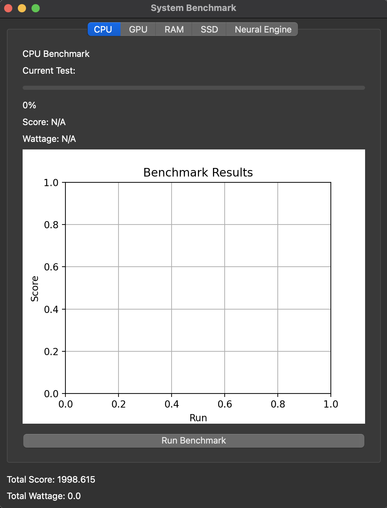

# Apple System Benchmark

This is very much a POC/First attempt, with that in mind this Python script performs a system benchmark for Apple devices using PyQt6 and Matplotlib libraries. The benchmark consists of five tests: CPU, GPU, RAM, SSD, and Neural Engine benchmarks (I will probably add in more benchmarks in the future).


# Version


## Installation

To run the benchmark, you will need to install the following dependencies:

- Python 3.8 or later
- PyQt6 (PyQt5 does not work with Apple silicon)
- Matplotlib
- Tensorflow
- Numpy

You can install these dependencies using pip and the requirements.txt file provided:


## Installation


```bash
  pip install -r requirements.txt
```

Once the dependencies are installed, you can run the application by executing the main.py script:

```
python main.py
```

    
## Running Benchmarks

To run a benchmark test, click the "Run Benchmark" button on the corresponding `BenchmarkWidget`. The benchmark results will be displayed on the Matplotlib graph and the total score and total wattage will be updated on the `MainWindow`.

To stop the benchmark, simply close the application window.

## Benchmark Tests

The benchmark consists of the following five tests:

### CPU Benchmark

The CPU benchmark measures the performance of the CPU by performing a series of mathematical calculations. The benchmark uses the `perform_cpu_benchmark` function from the `cpuBenchmark` module.

### GPU Benchmark

The GPU benchmark measures the performance of the GPU by rendering a 3D scene using OpenGL. The benchmark uses the `perform_gpu_benchmark` function from the `gpuBenchmark` module.

### RAM Benchmark

The RAM benchmark measures the performance of the RAM by reading and writing large amounts of data. The benchmark uses the `perform_ram_benchmark` function from the `ramBenchmark` module.

### SSD Benchmark

The SSD benchmark measures the performance of the SSD by reading and writing large files. The benchmark uses the `perform_ssd_benchmark` function from the `ssdBenchmark` module.

### Neural Engine Benchmark

The Neural Engine benchmark measures the performance of the Neural Engine by performing a series of machine learning tasks. The benchmark uses the `perform_neural_engine_benchmark` function from the `neBenchmark` module.

## Architecture

The benchmark is implemented using the following classes:

### BenchmarkWorker

The `BenchmarkWorker` class is a QThread that performs the benchmark in the background and emits signals to update the progress bar, the current test label, and the benchmark results, this was actually more difficult to implement than expected as the signal being emitted was not getting to the progress bar correctly, so the Architecture needed to be updated slightly.

### BenchmarkWidget

Each benchmark test is performed using a separate `BenchmarkWidget` class that inherits from `QWidget`. Each `BenchmarkWidget` contains a progress bar, a score label, a wattage label, and a Matplotlib graph that displays the benchmark results. I have implemented the single run score to show in the graph, but I will udpate this so that is shows in each benchmarks tab in a later revision

### MainWindow

The `MainWindow` class is the main window of the application that contains a `QTabWidget` with the five `BenchmarkWidget` instances. The `MainWindow` also displays the total score and total wattage of all benchmarks. 


# Notes
I have added more detail in the code with how each one of these benchmarks are run/calculated, I am sure these are not the best ways to run each benchmark but I was trying my best to target each section correctly when testing. I will try to make improvements on this as time goes on.
Lastly, the other difficulty I ran into was a consistent way of generating scores for each benchmark, this is still diffcult as I wanted it to be somewhat based on time and the systems ability to measure benchmarks, but this is not always consistent as I was able to find running the same benchmark multiple times would generate vastly different scores, so I tried to add in a form of weighting to even out these discrepancies.

# Wattage
Wattage.py is my attempt to use powermetrics command-line tool to measure the wattage used for each benchmark, this is still not working during this release and I think think this may be to do with the way this is being called and the options that are used, I have tried this in the terminal and it all seems to work correctly in a terminal envionment but when being moved into a Python runtime it seems to be no bueno. I have added in the architecture to handle this when this function is working correctly.

## Images


## Authors

- [@REllwood](https://github.com/REllwood)


# Contributing
Contributions are welcome! If you would like to contribute to the project, please follow these steps:

- Fork the repository.
- Create a new branch for your feature or bug fix.
- Make your changes and commit them with a descriptive commit message.
- Push your changes to your fork.
- Submit a pull request to the main repository.

# Reporting Bugs
If you encounter a bug while using the application, please report it by opening an issue on the GitHub repository. Please include a detailed description of the bug, steps to reproduce it, and any relevant error messages or screenshots. Not sure how responsive I will be, but I will try to improve this as time goes on.


## License

[](https://opensource.org/licenses/MIT)

