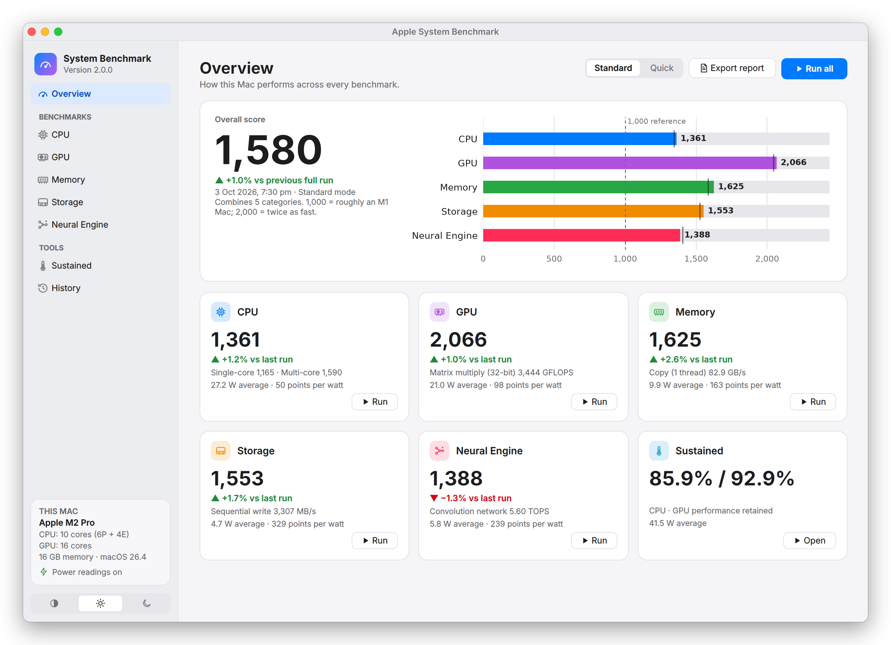
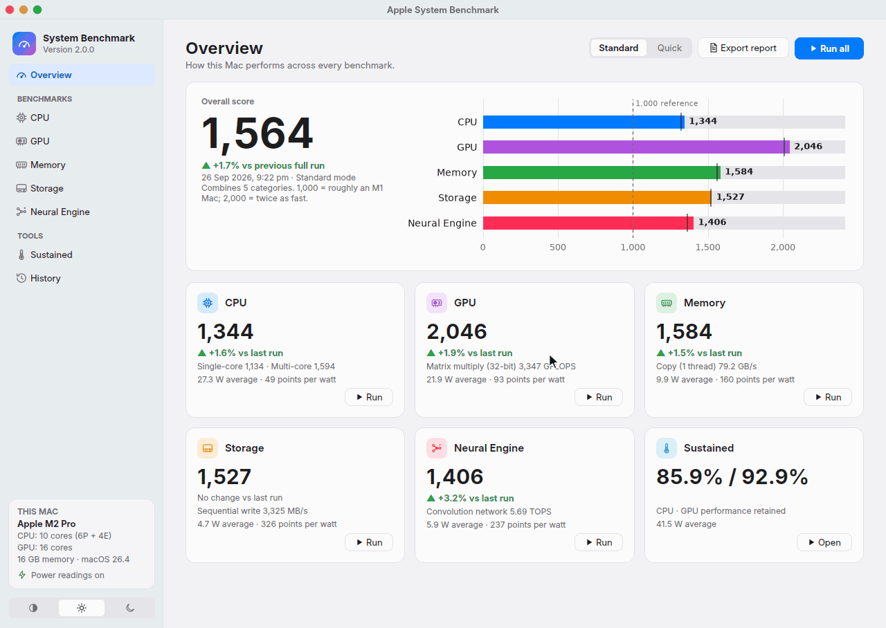
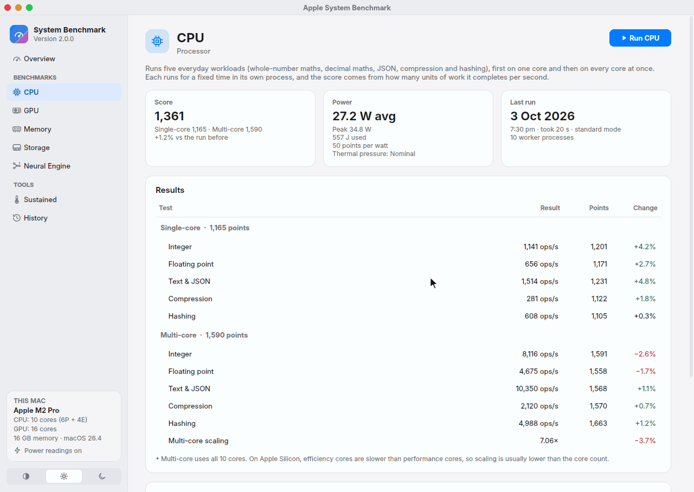
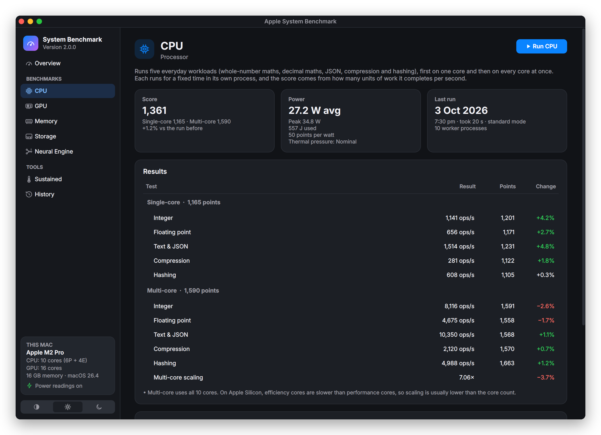
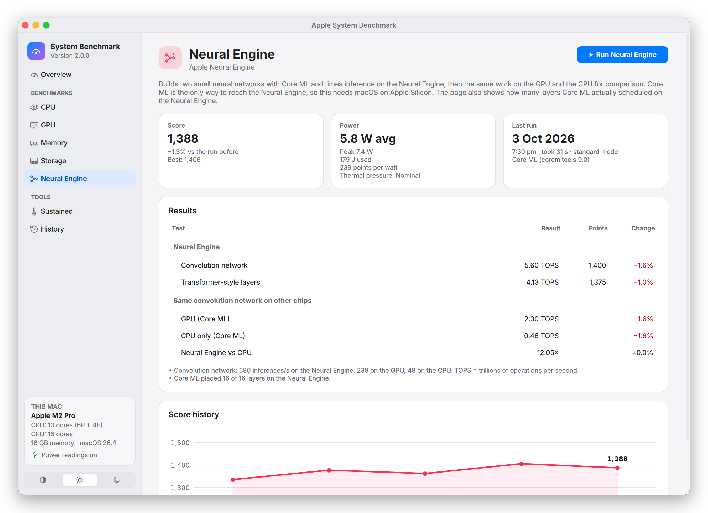
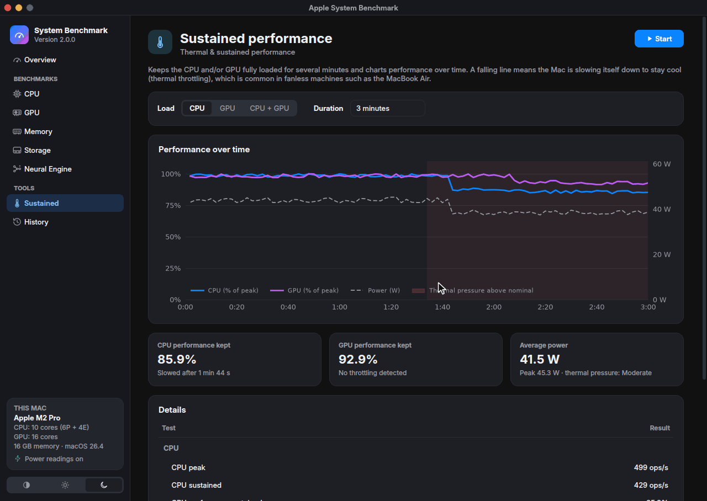
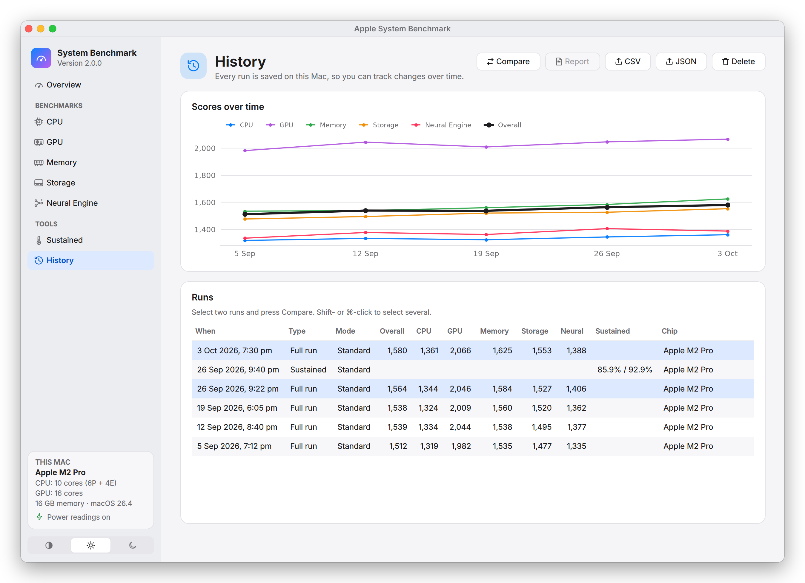
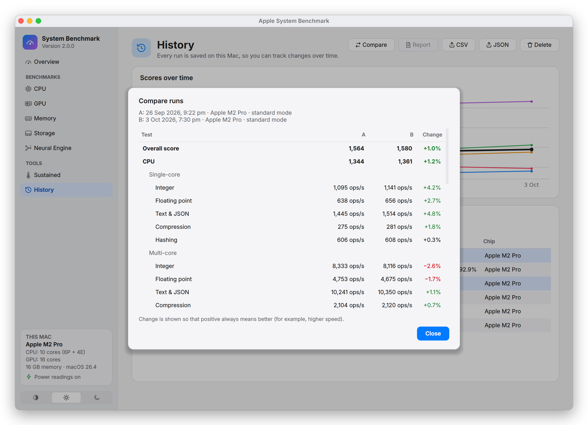
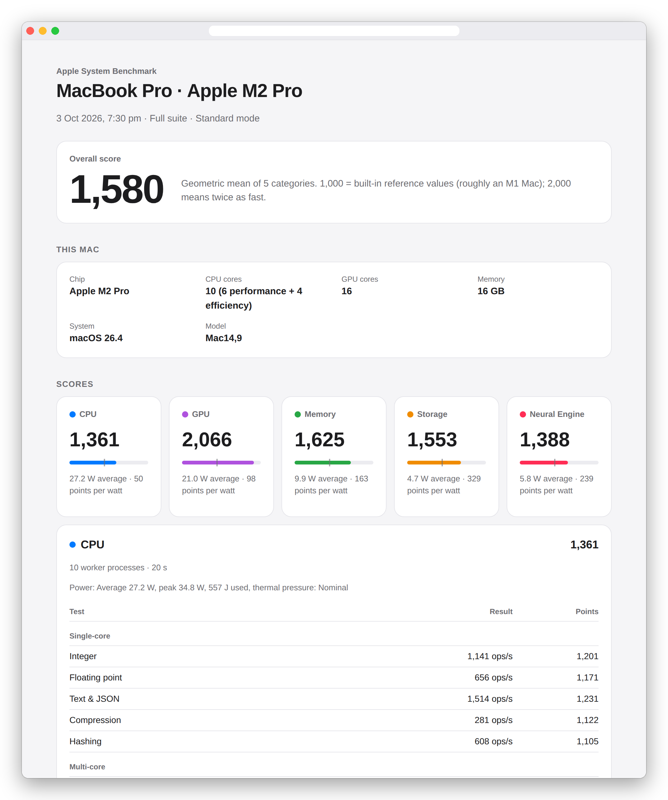

# Apple System Benchmark


[](https://opensource.org/licenses/MIT)

A desktop app (and command-line tool) that benchmarks the CPU, GPU, memory, storage and
Neural Engine of Apple Silicon Macs. Every test is timed, so faster hardware scores higher.
It also reports power draw and efficiency, tracks results over time, tests sustained
performance and thermal throttling, and exports shareable reports.

<picture>
  <source media="(prefers-color-scheme: dark)" srcset="screenshots/overview-dark.png">
  
</picture>

<sub>Screenshots and animations use illustrative sample data for a MacBook Pro with an M2 Pro chip, not real measurements. Animations are sped up.</sub>

## See it in action

**Run every benchmark.** Each card updates as soon as its benchmark finishes. The bar along the
bottom shows progress, live power draw and a Cancel button.



**Find your way around.** Switch between light and dark mode, open a benchmark for its full
breakdown and score history, and compare any two runs side by side.



## What's new in 2.0

Version 2.0 is a rewrite of the 0.1 proof of concept. The main changes:

- **Every score now measures speed.** In 0.1, several scores were constants or random-number averages that came out the same on any Mac. Every test is now timed and reported in real units (operations per second, GFLOPS, GB/s, MB/s, IOPS, TOPS).
- **The CPU test no longer hangs.** On Macs with fewer than 10 cores it used to loop forever, and on more than 10 it scored 0. It now runs on every core, whatever the count.
- **The RAM test no longer crashes the app**, and no longer tries to allocate about 16 GB.
- **The GPU test really uses the GPU.** It uses Apple's MLX framework on Metal instead of TensorFlow, which ran on the CPU.
- **The Neural Engine test really uses the Neural Engine.** It uses Core ML, the only public way to reach it; TensorFlow couldn't.
- **The SSD test measures the SSD.** The file cache is switched off, and write speed is actually timed.
- **Power readings work** (see [Power readings](#power-readings)).
- **`requirements.txt` installs cleanly.** The old pins conflicted with each other and had no Apple Silicon builds.
- **New in the app:** a redesigned interface with light and dark mode, a Cancel button, and errors shown in the app instead of crashing it.
- **New features:** results history with comparisons, a sustained/thermal test, a headless command-line mode, and HTML reports.

## Requirements

- A Mac with Apple Silicon (M1 or later) running macOS 13 Ventura or later, for the full suite
- Python 3.10 to 3.13

The app also runs on Intel Macs, Linux and Windows, with fewer tests. The GPU test falls back
to the CPU (shown, but not counted in the overall score), and the Neural Engine test and
power readings are skipped.

## Installation

```bash
python3 -m venv .venv
source .venv/bin/activate
pip install -r requirements.txt
```

## Running the app

```bash
python main.py
```

Press **Run all** on the Overview page, or open a single benchmark from the sidebar and press
**Run**. A full run takes about a minute and a half (around 30 seconds in **Quick** mode). The
first Neural Engine run takes a little longer while it builds its Core ML models.
For the most consistent results, plug in your Mac and close other apps.

Keyboard shortcuts: **⌘R** runs everything, **Esc** cancels, and **⌘1** to **⌘8** switch pages.

## Command line

Every feature also works from the terminal, without the window:

```bash
python main.py --cli                          # run the full suite
python main.py --cli --quick --only cpu,memory
python main.py --cli --json run.json --csv run.csv --report run.html
python main.py --cli --sustained 5 --sustained-mode both
python main.py --cli --storage-path /Volumes/External
python main.py --history                      # list saved runs
python main.py --system                       # show what was detected about this Mac
python main.py --setup-power                  # how to enable power readings
python main.py --help                         # everything else
```

The exit code is 0 on success, 1 if a benchmark failed, and 130 if you pressed Ctrl+C.

## The benchmarks

| Benchmark | What it measures | Reported in |
|---|---|---|
| **CPU** | Five workloads (prime sieve, Mandelbrot set, JSON, zlib compression, SHA-256), each timed for a fixed period on one core, then on every core at once. Each worker is a separate process, so the interface can't slow it down. | operations per second |
| **GPU** | 32-bit and 16-bit matrix multiplication, a 3×3 image convolution, and memory bandwidth, using MLX on the Metal GPU. | GFLOPS, GB/s |
| **Memory** | Copy speed (on one thread and several), read and write speed, and random access. Buffers are sized from free memory so the Mac never swaps. | GB/s, millions of reads per second |
| **Storage** | Sequential write and read of a 1 GB file, and random 4 KB reads and writes one at a time (queue depth 1). The file cache is off, writes are flushed to the drive, and the temporary file is always removed. | MB/s, IOPS |
| **Neural Engine** | Two networks (a convolution stack and transformer-style layers) run through Core ML on the Neural Engine, plus the same work on the GPU and CPU for comparison. The page also shows how many layers Core ML placed on the Neural Engine. | TOPS |
| **Sustained** | Keeps the CPU and/or GPU fully loaded for 1 to 20 minutes and charts performance, power and thermal pressure over time. It reports the peak, the sustained level, the percentage kept, and when throttling began. | % of peak |

Each benchmark has its own page with every test result, its points, the change since your
last run, power draw and a score history.

<p>
  
  
</p>

### Sustained performance and thermal throttling

Short benchmarks finish before a Mac heats up. The **Sustained** test keeps the CPU and/or GPU
fully loaded for several minutes and charts performance as it happens. A dip in the line, with
the shaded area for raised thermal pressure, shows when the Mac started slowing itself down to
stay cool.



## How scores work

- Each result is compared with a reference value. Matching it scores **1,000** points, and twice as fast scores 2,000.
- A benchmark's score is the geometric mean of its test scores. The **overall score** is the geometric mean of the five benchmark scores, so a 10% gain anywhere moves the total by the same amount.
- The built-in reference values are estimates, set so an M1-class Mac lands roughly near 1,000. To use your own baseline, run this on the Mac you want to compare against:

  ```bash
  python main.py --cli --calibrate          # this Mac now scores 1,000 everywhere
  python main.py --reset-calibration        # back to the built-in values
  ```

- Tests that run on substitute hardware keep their measurements but get no points, so they can't pass for real results. For example, a GPU test that fell back to the CPU.

## Power readings

Watts, energy (joules), points per watt and thermal pressure come from `powermetrics`, which is
built into macOS but only runs as an administrator. The app never asks for or handles your
password. It uses `sudo -n`, which only works if you've allowed this one exact command to run
without a password.

`python main.py --setup-power` prints the exact steps with your username filled in. In short:

1. Run `sudo visudo -f /etc/sudoers.d/powermetrics`.
2. Add the line it shows, which looks like this:

   ```
   yourname ALL=(root) NOPASSWD: /usr/bin/powermetrics --samplers cpu_power\,gpu_power\,thermal -i 500 -n 7200
   ```

3. Save, then restart the app. The sidebar will show **Power readings on**.

The rule allows only `powermetrics` with these exact options, so it can't be used to run
anything else as an administrator (or to write files, which `powermetrics -o` could otherwise
do). To remove it, run `sudo rm /etc/sudoers.d/powermetrics`.

## History, comparisons and reports

Every run is saved automatically. On the **History** page you can:

- chart scores over time,
- select two runs and press **Compare** to see every test side by side,
- export runs as CSV or JSON,
- save an HTML report of any run.

<p>
  
  
</p>

**Export report** on the Overview page saves a report of your latest results. Reports are single
self-contained files with no external links, so you can email them or open them offline. They
follow the reader's light or dark setting.

<p align="center">
  
</p>

Data is stored in `~/Library/Application Support/Apple System Benchmark/`:

- `history.jsonl` holds the saved runs,
- `references.json` holds your calibration, if you've made one,
- `models/` holds cached Core ML models.

## Project layout

```
main.py                    starts the app, or the command line with --cli
asbench/
  workers.py               CPU workloads and the worker-process pool
  benchmarks/              one module per benchmark (cpu, gpu, memory, storage, neural, sustained)
  core/                    results, scoring, power sampling, history, reports, system info
  cli.py                   the command-line interface
  ui/                      the PyQt6 app: window, pages, theme, charts, icons
tests/                     pytest suite (runs headless)
```

## Development

```bash
pip install -r requirements-dev.txt
pytest
```

The tests run headless, including the GUI tests. They take about a minute, and on non-Mac
systems they cover every fallback path.

## Limitations

- The CPU workloads run in Python, so they measure how fast your Mac runs Python code as well as raw CPU speed. That's realistic for Python apps, but results aren't comparable with benchmarks written in C, such as Geekbench.
- Results vary by a few per cent between runs, especially in Quick mode. Background activity, Low Power Mode and running on battery all lower scores.
- Core ML decides which layers run on the Neural Engine. The Neural Engine page shows where they actually ran.
- The storage test measures the drive holding the test folder. By default that's the internal SSD; use **Choose drive…** (or `--storage-path`) to test another.

## Authors

- [@REllwood](https://github.com/REllwood)

## Contributing

Contributions are welcome! To contribute:

- Fork the repository.
- Create a new branch for your feature or bug fix.
- Make your changes (and run `pytest`), then commit them with a descriptive message.
- Push your changes to your fork.
- Open a pull request to the main repository.

## Reporting bugs

If you find a bug, please open an issue on GitHub. Include what you did, what happened, any
error messages, and the output of `python main.py --system`.

## Licence

[MIT](https://opensource.org/licenses/MIT)
